# Defect Samples Generation for Industrial Datasets with DFM-GAN

## 🔍 Introduction
Industrial defect inspection plays a critical role in ensuring manufacturing quality, reliability, and safety. However, real defect samples are often scarce in production environments, which severely limits the performance of deep learning models that depend on large and diverse training samples to learn the general and varied features of defects. To address this challenge, this project implements **DFM-GAN** (Defect-aware Feature Manipulation GAN) - a few-shot image generation approach that synthesizes realistic and diverse defect images from only a few real defect samples. Unlike previous traditional methods that learn how to generate entire defective samples, **DFM-GAN** manipulates only localized defect regions while preserving the structural integrity of the remaining parts of the object . This strategy approach allows the model to learn defect patterns efficiently without requiring large datasets.

---

## 🧩 Model Pipeline

This section describes the complete generation pipeline of **DFM-GAN**:

### 🔹 1. Backbone Pre-training on Defect-Free Images

DFM-GAN uses **StyleGAN2-ADA** generator as the backbone. It is first trained on **large numbers of defect-free images** to learn how to generate diverse normal images of the object (learns to reconstruct defect-free images). Through this stage, the backbone generator encodes rich object features in its network

### 🔹 2. Defect-Aware Fine-Tuning with Few Defect Samples

After backbone training:

- **Backbone weights are entirely frozen.**  
- New modules called **Defect-Aware Residual Blocks (DFMs)** are attached to the generator.  
- These DFMs are trained using **only a few real defect images and their defect masks**.

During this stage, the model learns to:

- localize where defects appear  
- modify feature maps only inside the defect regions  
- keep clean regions unchanged  
- generate realistic shapes, textures, and patterns of defects  

This design allows DFM-GAN to learn defect patterns effectively while preserving the prior knowledge of normal images.

---

## 🧪 Experiments
We evaluate DFM-GAN on 2 benchmark datasets for industrial defect inspection: **MVTec AD** and **VisA**. These datasets cover multiple object categories, diverse defect types, and realistic industrial imaging conditions.

---

### 🧵 1. Experiments on MVTec AD

**MVTec AD** is a high-quality industrial anomaly detection dataset containing **15 object and texture categories**, each with various defects such as scratches, holes, contamination, broken,...

Below are example results for some categories:

#### **1. Bottle**
| Good Samples | Real Defects | Generated Defects |
|--------------|--------------|-------------------|
|  |  | 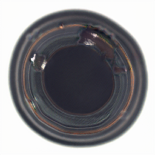 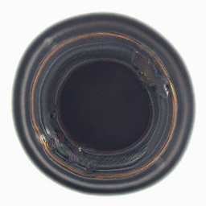 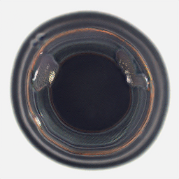 |

#### **2. Capsule**
| Good Samples | Real Defects | Generated Defects |
|--------------|--------------|-------------------|
|  |  | 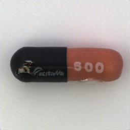   |

#### **3. Carpet**
| Good Samples | Real Defects | Generated Defects |
|--------------|--------------|-------------------|
|  |  | 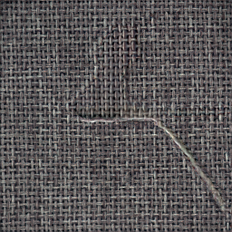 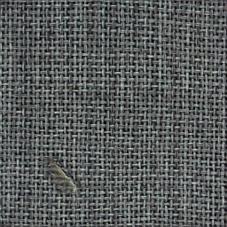 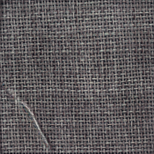 |

#### **4. Hazelnut**
| Good Samples | Real Defects | Generated Defects |
|--------------|--------------|-------------------|
|  |  | 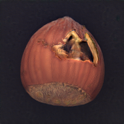 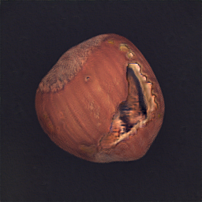 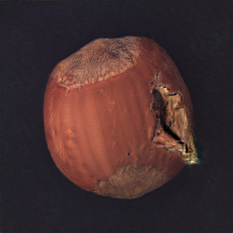 |

---

### 📦 2. Experiments on VisA Dataset

**VisA** is a large-scale industrial dataset covering **12 industrial products** including food items, manufactured goods, and electronic components. VisA includes **complex textures** and **fine-grained defects**.

Below are example results for some categories:

#### **1. Cashew**
| Good Samples | Real Defects | Generated Defects |
|--------------|--------------|-------------------|
| 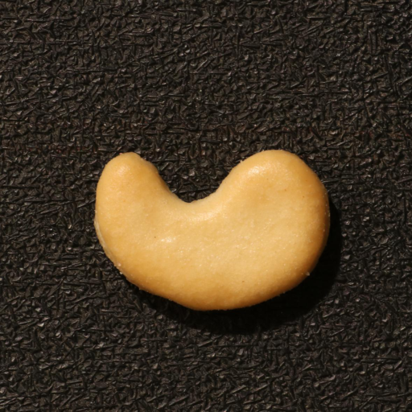 | 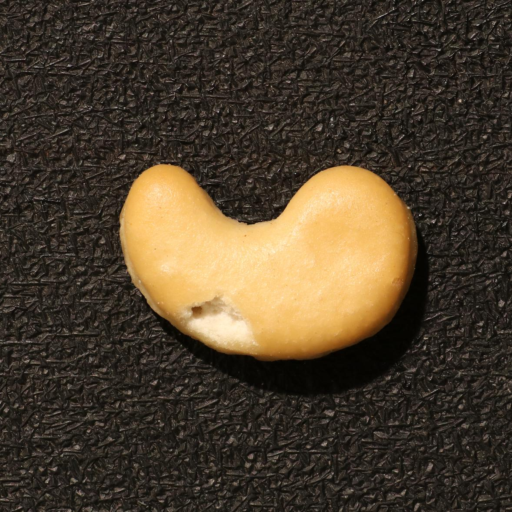 | 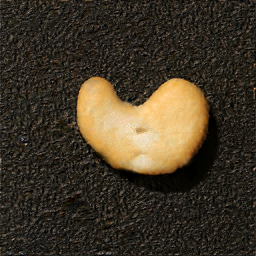 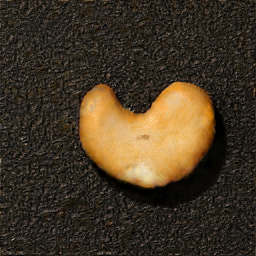  |

#### **2. ChewingGum**
| Good Samples | Real Defects | Generated Defects |
|--------------|--------------|-------------------|
| 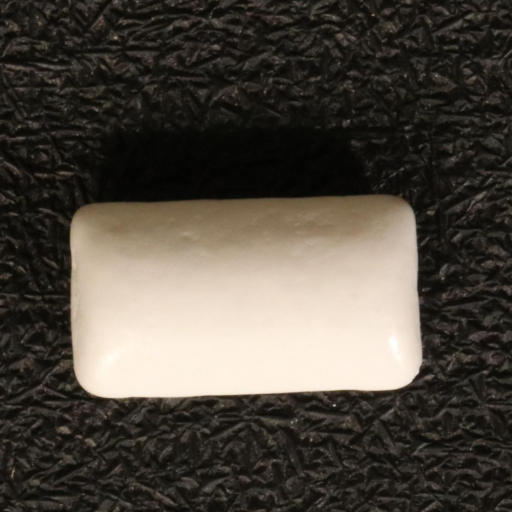 | 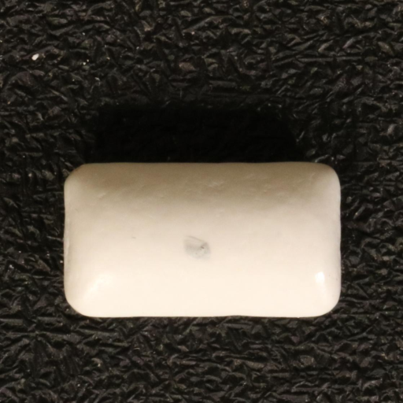 | 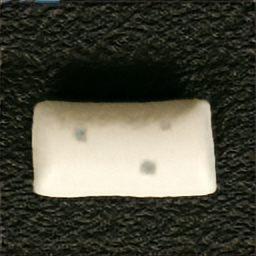 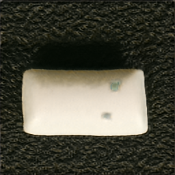 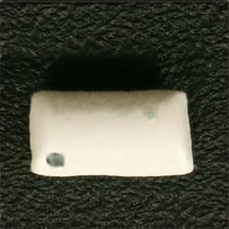 |

#### **3. Frym**
| Good Samples | Real Defects | Generated Defects |
|--------------|--------------|-------------------|
| 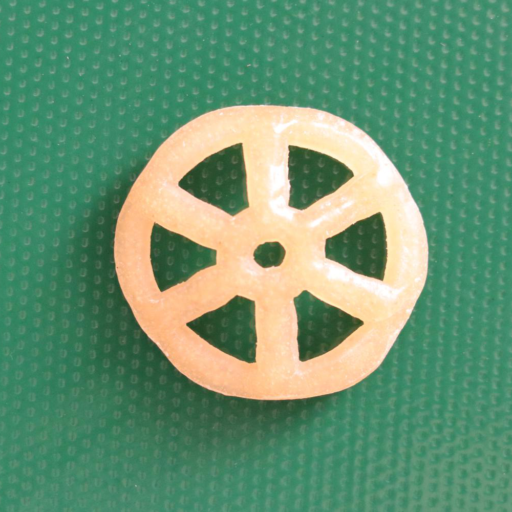 | 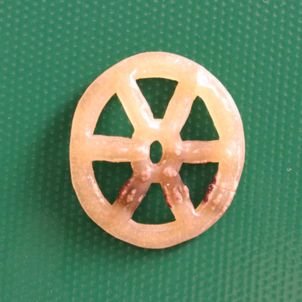 | 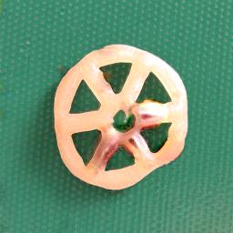 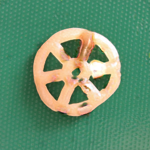 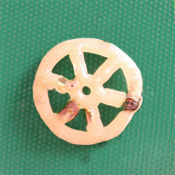 |

#### **4. PipeFryum**
| Good Samples | Real Defects | Generated Defects |
|--------------|--------------|-------------------|
| 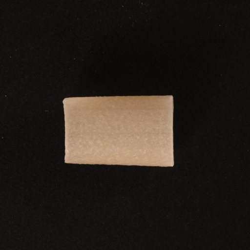 | 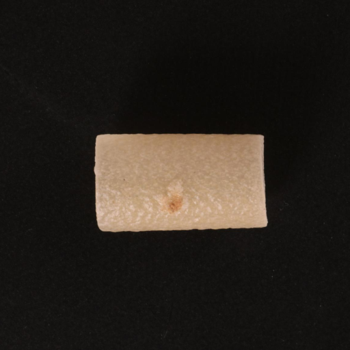 | 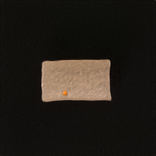  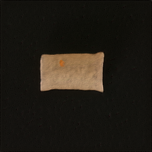 |
